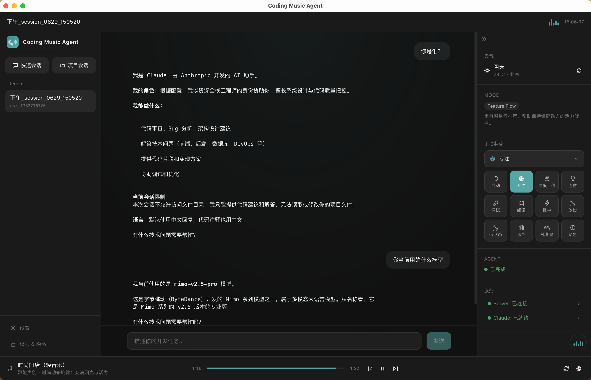

# 🎵 Coding Music Agent

> 面向 AI Coding 用户的沉浸式桌面工作舱

一个将编程 Agent 与音乐 Agent 深度融合的桌面应用。在你写代码、调试、重构时，音乐 Agent 会自动感知你的开发状态，为你推荐合适的音乐，营造沉浸式的编码氛围。

## ✨ 核心功能

- **智能编程 Agent** — 内置 Claude Code，支持代码编写、调试、重构等开发任务
- **音乐氛围引擎** — 基于开发状态自动推荐音乐，支持网易云音乐海量曲库
- **状态感知** — 自动识别 Debug、Feature、Refactor、Review 等编码状态
- **沉浸式界面** — 根据音乐和编码状态动态调整界面氛围
- **隐私优先** — 本地运行，命令执行需要授权确认

## 效果展示



## 🚀 快速开始

### 环境要求

#### 基础环境

| 依赖 | 版本要求 | 用途 |
|------|----------|------|
| Node.js | >= 20.0.0 | 运行 sidecar 服务和前端构建 |
| pnpm | >= 9.0.0 | 包管理器 |
| Rust | 最新稳定版 | Tauri 桌面应用编译 |
| Claude Code | 最新版 | AI 编程 Agent（可选） |

#### 操作系统

| 系统 | 支持状态 |
|------|----------|
| macOS | ✅ 完全支持（推荐） |
| Windows | ✅ 支持 |
| Linux | ✅ 支持 |

#### 安装依赖

```bash
# 安装 Node.js (推荐使用 nvm)
curl -o- https://raw.githubusercontent.com/nvm-sh/nvm/v0.39.0/install.sh | bash
nvm install 20
nvm use 20

# 安装 pnpm
npm install -g pnpm

# 安装 Rust (macOS/Linux)
curl --proto '=https' --tlsv1.2 -sSf https://sh.rustup.rs | sh

# 或使用 Homebrew (macOS)
brew install rust

# 验证安装
node --version      # v20.x.x
pnpm --version      # 9.x.x
rustc --version     # 1.x.x
cargo --version     # 1.x.x
```

### 安装与运行

```bash
# 克隆项目
git clone <repository-url>
cd music-coding

# 安装依赖
pnpm install

# 启动开发模式（同时启动 sidecar + desktop）
pnpm dev
```

### 打包安装包

```bash
# macOS DMG 安装包
pnpm package:dmg
```

打包产物：`apps/desktop/src-tauri/target/release/bundle/dmg/Coding Music Agent.dmg`

### 安装说明（macOS）

1. **快捷安装**
   - 直接双击快捷方式 👉 [Coding Music Agent.dmg](./docs/Coding%20Music%20Agent.dmg) 安装即可

2. **安装应用**
   - 双击打开 DMG 安装包
   - 将 `Coding Music Agent.app` 拖动到 `Applications` 文件夹

3. **解除安全限制**
   - 由于应用未签名，macOS 会阻止运行，需要手动解除限制：
   ```bash
   xattr -rd com.apple.quarantine /Applications/Coding\ Music\ Agent.app
   ```

4. **启动应用**
   - 打开 Launchpad 或 Applications 文件夹
   - 点击 `Coding Music Agent` 图标启动

> 💡 **提示**：首次启动可能需要几秒钟加载，请耐心等待。

## 🏗️ 项目结构

```
music-coding/
├── apps/
│   ├── desktop/              # Tauri 桌面应用
│   │   ├── src/              # React 前端代码
│   │   ├── src-tauri/        # Rust 后端代码
│   │   └── package.json
│   └── sidecar/              # Node.js 服务
│       ├── src/              # TypeScript 源码
│       └── package.json
├── packages/
│   └── shared-types/         # 共享类型定义
├── docs/                     # 项目文档
├── .env                      # 环境配置
└── package.json              # 根配置
```

## 🎯 核心概念

### CodingMoodState

系统核心状态，驱动音乐推荐和 UI 氛围：

| 状态 | 说明 | 音乐风格 |
|------|------|----------|
| `feature_flow` | 写新功能 | 中 BPM，青蓝 |
| `debug_calm` | Debug | 低刺激，蓝灰 |
| `deep_refactor` | 重构 | Ambient，蓝紫 |
| `review_focus` | Review | 极低干扰 |
| `emergency_focus` | 线上故障 | 白噪音 |
| `low_energy` | 疲劳 | 温和陪伴 |
| `late_night_flow` | 深夜 | 深色 ambient |
| `neutral` | 默认 | 平衡 |

### 数据流

```
用户操作 / Agent 事件 / 时间天气
  → Context Provider → determineMood → RecommendationOrchestrator
  → Music Provider → Music Agent 事件 → React UI 更新
```

## 🛠️ 开发命令

```bash
# 开发
pnpm dev                    # 同时启动 sidecar + desktop
pnpm dev:desktop            # 仅启动 desktop
pnpm dev:sidecar            # 仅启动 sidecar

# 构建
pnpm build                  # 构建前端 + sidecar
pnpm package:dmg            # 打包 DMG 安装包

# 代码质量
pnpm typecheck              # 类型检查
pnpm lint                   # 代码检查
pnpm test                   # 单元测试
```

## ⚙️ 环境配置

根目录 `.env` 文件：

```bash
# Sidecar 服务配置
VITE_SIDECAR_HOST=localhost
VITE_SIDECAR_PORT=4567
```

修改后需要重启服务或重新打包。

## 📚 文档
- [打包指南](./docs/sidecar-packaging.md)
- [音乐推荐](./.claude/docs/07-music-recommendation-roadmap.md)

## 🏛️ 技术栈

| 层级 | 技术 |
|------|------|
| 前端 | React 18 + TypeScript 5 + Zustand + Tailwind CSS 4 |
| 桌面 | Tauri 2.x (Rust) |
| 后端 | Node.js + Express + Claude Agent SDK |
| 音乐 | 网易云音乐 API |
| 构建 | Vite + esbuild + pnpm |

## 📄 License

Private - 仅限内部使用
