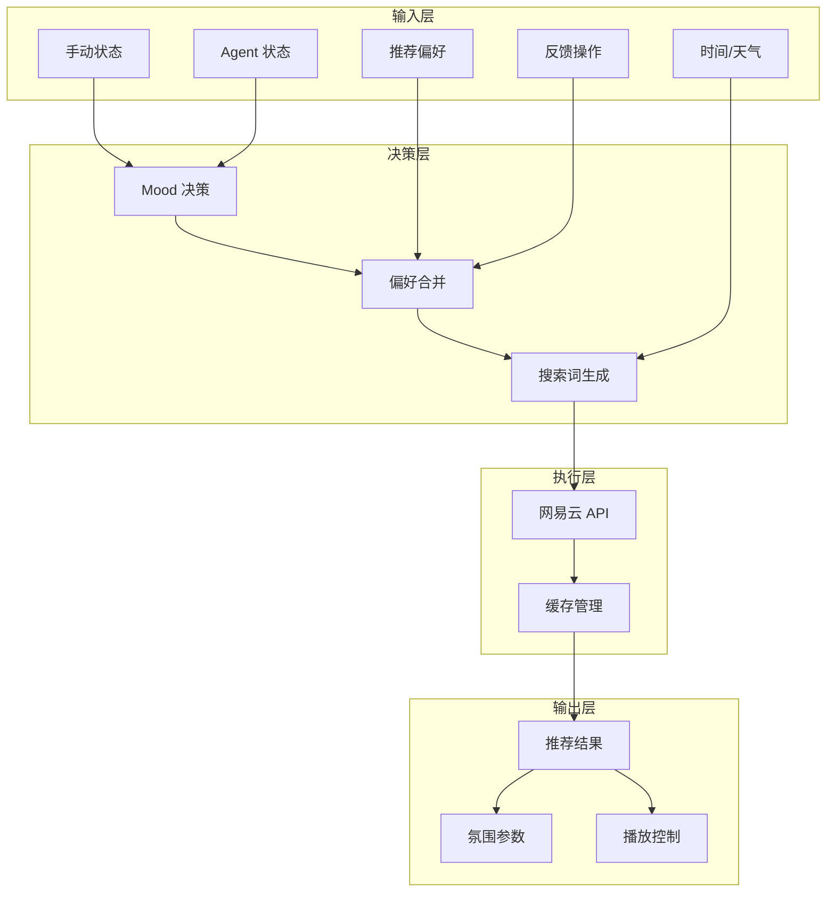
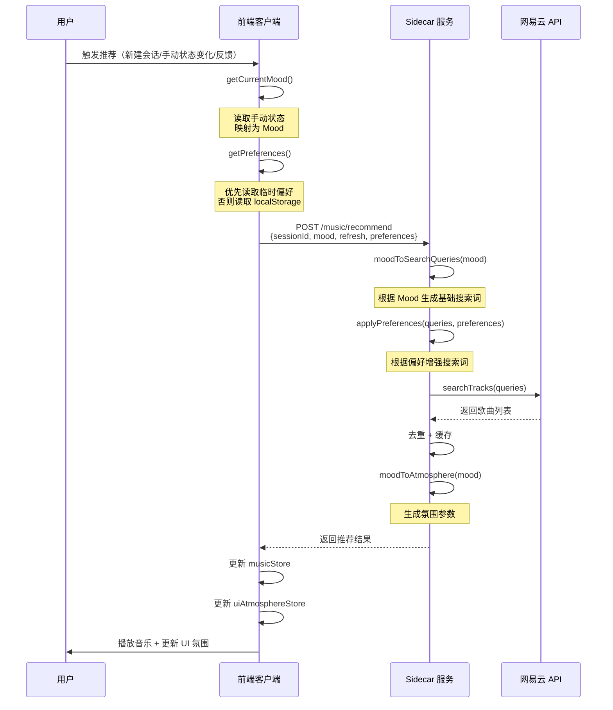

# 音乐推荐逻辑文档

> 文档版本：v2.0
> 更新日期：2026-06-25

---

## 一、推荐系统架构



---

## 二、核心概念

### 2.1 CodingMoodState（Mood 状态）

系统的核心状态，决定推荐的音乐风格：

| Mood | 标签 | 触发条件 | 音乐特征 |
|------|------|---------|---------|
| `feature_flow` | Feature Flow | 写新功能、需要专注 | 中 BPM、推进感、轻节奏电子 |
| `debug_calm` | Debug Calm | 调试、需要冷静 | 低刺激、弱人声、稳定重复 |
| `deep_refactor` | Deep Refactor | 深夜重构 | ambient、lo-fi、低 BPM |
| `review_focus` | Review Focus | 代码 Review | 极低干扰、弱人声 |
| `emergency_focus` | Emergency Focus | 紧急修复 | 白噪音、环境声 |
| `low_energy` | Low Energy | 疲劳、恢复 | 温和陪伴、逐步提振 |
| `late_night_flow` | Late Night Flow | 深夜编码 | 深色 ambient、低亮度 |
| `recovery_mode` | Recovery Mode | 多次失败后恢复 | 渐进恢复 |
| `neutral` | Neutral | 默认状态 | 平衡 |

### 2.2 ManualState（手动状态）

用户主动选择的状态，优先级最高：

| 手动状态 | 对应 Mood | 说明 |
|---------|----------|------|
| `need_focus` | `feature_flow` | 需要专注 |
| `need_relax` | `low_energy` | 需要放松 |
| `need_energy` | `feature_flow` | 需要提神 |
| `low_state` | `low_energy` | 状态不好 |
| `emergency` | `emergency_focus` | 紧急模式 |
| `deep_work` | `deep_refactor` | 深度工作 |
| `creative` | `feature_flow` | 创意模式 |
| `reading` | `review_focus` | 阅读代码 |
| `debugging` | `debug_calm` | 调试模式 |
| `late_night` | `late_night_flow` | 深夜编码 |
| `background` | `review_focus` | 纯背景音 |

### 2.3 Preferences（推荐偏好）

用户的口味倾向，影响搜索关键词：

| 偏好 ID | 标签 | 搜索关键词增强 |
|---------|------|---------------|
| `focus` | 更专注 | 专注、编程、工作、效率 |
| `relaxed` | 更轻松 | 放松、舒缓、治愈、轻柔 |
| `energy` | 更燃 | 活力、节奏、动感、提神 |
| `calm` | 更平静 | 平静、安静、深夜、冥想 |
| `ambient` | 环境音 | 白噪音、自然、环境、雨声 |

### 2.4 Feedback（反馈操作）

用户的即时操作，会临时覆盖偏好：

| 反馈动作 | 临时偏好 | 效果 |
|---------|---------|------|
| `more_focus` | `['focus']` | 临时切换到专注风格 |
| `more_relaxed` | `['relaxed']` | 临时切换到轻松风格 |
| `more_energy` | `['energy']` | 临时切换到活力风格 |
| `less_distraction` | `['calm']` | 临时切换到平静风格 |
| `change_set` | `null`（清除） | 清除临时偏好，刷新推荐 |
| `dislike` | 无影响 | 跳过当前歌曲 |
| `keep_vibe` | `null`（清除） | 清除临时偏好，保持氛围 |

---

## 三、优先级规则

### 3.1 Mood 优先级

```
手动状态 > Agent 状态 > 默认 neutral
```

**示例：**
- 用户选择"需要专注" → `feature_flow`
- Agent 进入 Debug → `debug_calm`
- 无任何状态 → `neutral`

### 3.2 偏好优先级

```
临时偏好（反馈设置） > 持久偏好（设置面板） > 无偏好
```

**示例：**
- 用户在设置面板选择"更燃"
- 用户点击反馈"更专注"
- 此时临时偏好为 `['focus']`，覆盖持久偏好 `['energy']`
- 用户点击"换一组"或"保持氛围"
- 临时偏好清除，恢复使用持久偏好 `['energy']`

---

## 四、推荐流程

### 4.1 完整推荐流程



### 4.2 搜索词生成逻辑

#### 基础搜索词（根据 Mood）

```typescript
const moodToQueries = {
  feature_flow: ['电子 节奏', '轻音乐 活力', 'EDM 编程'],
  debug_calm: ['纯音乐 舒缓', '钢琴 平静', 'ambient 放松'],
  deep_refactor: ['lo-fi 深夜', 'ambient 沉浸', '电子 低音'],
  review_focus: ['白噪音', '纯音乐 专注', '自然声音'],
  emergency_focus: ['白噪音', '雨声', '自然声音'],
  low_energy: ['钢琴 温暖', '轻音乐 治愈', '纯音乐 舒适'],
  late_night_flow: ['深夜 电子', 'lo-fi night', 'ambient dark'],
  recovery_mode: ['轻音乐 恢复', '钢琴 轻柔', '电子 柔和'],
  neutral: ['纯音乐', '轻音乐', 'ambient'],
};
```

#### 偏好增强逻辑

```typescript
// 原始搜索词
queries = ['电子 节奏', '轻音乐 活力']

// 偏好关键词
preferences = ['energy']
preferenceKeywords = ['活力', '节奏', '动感', '提神']

// 增强后搜索词
adjustedQueries = [
  '电子 节奏',           // 原始
  '电子 节奏 活力',       // 原始 + 随机偏好关键词
  '轻音乐 活力',          // 原始
  '轻音乐 活力 节奏',     // 原始 + 随机偏好关键词
]
```

---

## 五、状态覆盖规则

### 5.1 场景一：基础使用

```
用户状态：无手动状态，无偏好设置
Mood：neutral（默认）
搜索词：['纯音乐', '轻音乐', 'ambient']
结果：平衡风格音乐
```

### 5.2 场景二：手动状态 + 偏好

```
用户状态：选择"需要专注"，设置偏好"更燃"
Mood：feature_flow（从手动状态映射）
偏好：['energy']
搜索词增强：
  - 原始：['电子 节奏', '轻音乐 活力', 'EDM 编程']
  - 增强：['电子 节奏 活力', '轻音乐 活力 节奏', 'EDM 编程 动感']
结果：有活力的专注音乐
```

### 5.3 场景三：反馈覆盖偏好

```
初始状态：
  - 手动状态：无
  - 持久偏好：['energy']
  - Mood：neutral

用户点击反馈"更专注"：
  - 临时偏好：['focus']（覆盖持久偏好）
  - Mood：feature_flow（从反馈映射）
  - 搜索词：['电子 节奏 专注', '轻音乐 活力 编程', ...]
  - 结果：专注风格音乐

用户点击"换一组"：
  - 临时偏好：null（清除）
  - 恢复使用持久偏好：['energy']
  - Mood：neutral（重置）
  - 搜索词：['纯音乐 活力', '轻音乐 节奏', ...]
  - 结果：恢复原来的偏好风格
```

### 5.4 场景四：Agent 状态影响

```
Agent 状态：进入 Debug（多次失败）
手动状态：无
Mood：debug_calm（从 Agent 状态推断）
搜索词：['纯音乐 舒缓', '钢琴 平静', 'ambient 放松']
结果：平静的调试音乐
```

### 5.5 场景五：时间因素

```
时间：深夜 23:00
手动状态：无
Mood：late_night_flow（从时间推断）
搜索词：['深夜 电子', 'lo-fi night', 'ambient dark']
结果：深夜氛围音乐
```

---

## 六、缓存策略

### 6.1 缓存键

缓存以 `CodingMoodState` 为键：

```typescript
trackCache: Map<CodingMoodState, MusicTrack[]>
```

### 6.2 缓存行为

| 场景 | 行为 |
|------|------|
| 首次请求某 Mood | 从 API 获取，缓存结果 |
| 相同 Mood 再次请求 | 返回缓存 |
| `refresh = true` | 清除该 Mood 缓存，重新获取 |
| 切换到不同 Mood | 使用新 Mood 的缓存（如有） |

### 6.3 缓存失效

- 用户点击"换一组" → `refresh = true`，清除缓存
- 用户点击反馈 → 可能触发新 Mood，使用新缓存
- 会话结束 → 缓存保留（下次会话可复用）

---

## 七、氛围参数

### 7.1 氛围参数结构

```typescript
interface MusicAtmosphere {
  id: string;
  label: string;           // 如 "Feature Flow"
  mood: CodingMoodState;
  intensity: 'low' | 'medium' | 'high';        // 强度
  distractionLevel: 'minimal' | 'balanced' | 'energetic';  // 干扰程度
  animationLevel: 'none' | 'subtle' | 'active';  // 动效强度
  colors: {
    backgroundGradient: string;  // 背景渐变
    edgeGlow: string;           // 边缘光颜色
    accent: string;             // 强调色
  };
}
```

### 7.2 各 Mood 的氛围配置

| Mood | 强度 | 干扰 | 动效 | 边缘光 |
|------|------|------|------|--------|
| `feature_flow` | medium | balanced | active | #58A6A6（青蓝） |
| `debug_calm` | low | minimal | subtle | #6F8FAF（蓝灰） |
| `deep_refactor` | low | minimal | subtle | #7E6FB5（蓝紫） |
| `review_focus` | low | minimal | none | #7A8B9A（灰蓝） |
| `emergency_focus` | low | minimal | none | #B56B6B（红灰） |
| `low_energy` | low | minimal | subtle | #9A8BAF（暖灰紫） |
| `late_night_flow` | low | minimal | subtle | #4A5A7A（深蓝） |
| `recovery_mode` | low | minimal | subtle | #58A6A6（青蓝） |
| `neutral` | medium | balanced | subtle | rgba(255,255,255,0.08) |

---

## 八、触发时机

### 8.1 自动触发

| 事件 | 触发行为 |
|------|---------|
| 新建会话 | 自动获取推荐 |
| 手动状态变化 | 重新获取推荐 |
| Agent 状态变化 | 可能触发重新推荐 |
| 时间段变化 | 可能触发重新推荐 |

### 8.2 手动触发

| 操作 | 触发行为 |
|------|---------|
| 点击"换一组" | `refresh = true`，清除缓存，重新获取 |
| 点击反馈按钮 | 设置临时偏好，切换 Mood，重新获取 |
| 保存推荐偏好 | 清除缓存，重新获取 |
| 点击下一首 | 播放队列中的下一首 |

---

## 九、数据流示意

### 9.1 推荐请求数据流

```typescript
// 前端请求
{
  sessionId: "session_123",
  mood: "feature_flow",           // 从手动状态或 Agent 状态推断
  refresh: false,                 // 是否强制刷新
  preferences: ["focus", "energy"] // 偏好设置
}

// Sidecar 处理
1. 根据 mood 获取基础搜索词
2. 根据 preferences 增强搜索词
3. 调用网易云 API 搜索
4. 去重 + 缓存
5. 生成氛围参数

// 返回结果
{
  id: "rec_abc123",
  sessionId: "session_123",
  mode: "smart_radio",
  title: "Feature Flow Radio",
  reason: "来自网易云推荐，适合推进新功能的节奏感音乐。",
  tracks: [...],                  // 歌曲列表
  atmosphere: {                   // 氛围参数
    mood: "feature_flow",
    intensity: "medium",
    colors: { edgeGlow: "#58A6A6" }
  },
  contextUsed: ["mood", "time", "netease"],
  createdAt: "2026-06-24T10:00:00Z"
}
```

### 9.2 状态存储结构

```typescript
// musicStore
{
  sessions: {
    "session_123": {
      recommendation: {...},      // 当前推荐
      queue: [...],               // 播放队列
      currentIndex: 0,            // 当前播放索引
      mode: "smart_radio"         // 推荐模式
    }
  },
  playback: {
    status: "playing",
    currentTrack: {...},
    volume: 30
  }
}

// contextStore
{
  context: {
    manualState: "need_focus",    // 手动状态
    timeOfDay: "afternoon",
    agentStatus: "running"
  }
}

// localStorage
{
  musicPreferences: ["focus", "energy"]  // 持久偏好
}

// 内存（临时）
sessionPreferences: ["focus"]  // 临时偏好（优先级最高）
```

---

## 十、异常处理

### 10.1 推荐失败

```
网易云 API 失败
  ↓
尝试获取热歌榜（fallback）
  ↓
仍然失败
  ↓
返回空推荐，显示错误提示
```

### 10.2 歌曲不可播放

```
获取推荐成功
  ↓
检查歌曲 playUrl
  ↓
过滤不可播放歌曲
  ↓
如果有可播放歌曲 → 正常播放
如果全部不可播放 → 显示"暂无可播放歌曲"
```

### 10.3 权限未授权

```
网易云未连接
  ↓
显示"点击播放开始体验"
  ↓
用户点击播放
  ↓
引导授权流程
```

---

## 十一、配置项

### 11.1 搜索配置

| 配置项 | 默认值 | 说明 |
|--------|-------|------|
| 最大搜索结果 | 50 | 每次搜索最多获取的歌曲数 |
| 缓存有效期 | 会话内 | 缓存在会话结束前有效 |
| 搜索超时 | 10s | 网易云 API 超时时间 |

### 11.2 播放配置

| 配置项 | 默认值 | 说明 |
|--------|-------|------|
| 默认音量 | 30% | 初始播放音量 |
| 自动播放 | 是 | 获取推荐后自动播放第一首 |

---


**评分维度：**

| 维度 | 权重 | 计算方法 |
|------|------|---------|
| 艺术家多样性 | 50% | 唯一艺术家数 / 总曲目数 |
| 专辑多样性 | 30% | 唯一专辑数 / 总曲目数 |
| 时长多样性 | 20% | 时长标准差归一化 |

**阈值配置：**
- 艺术家多样性：0.6
- 专辑多样性：0.5
- 时长多样性：0.4
- 总体多样性：0.5

---

## 十二、相关代码位置

| 模块 | 文件路径 |
|------|---------|
| 前端推荐客户端 | `apps/desktop/src/clients/musicClient.ts` |
| 前端反馈组件 | `apps/desktop/src/components/music/FeedbackButtons.tsx` |
| 前端偏好设置 | `apps/desktop/src/components/music/RecommendationPreferences.tsx` |
| 前端播放栏 | `apps/desktop/src/components/music/MiniPlayerBar.tsx` |
| 前端展开面板 | `apps/desktop/src/components/music/ExpandedPanel.tsx` |
| Sidecar 音乐服务 | `apps/sidecar/src/music/service.ts` |
| Sidecar 网易云提供者 | `apps/sidecar/src/music/netease.ts` |
| Sidecar 歌曲特征 | `apps/sidecar/src/music/features.ts` |
| Sidecar 推荐路由 | `apps/sidecar/src/server/app.ts` |
| Sidecar 偏好服务 | `apps/sidecar/src/preference/service.ts` |
| Sidecar 听歌历史 | `apps/sidecar/src/preference/history.ts` |
| Sidecar 协同过滤 | `apps/sidecar/src/recommendation/collaborative.ts` |
| 共享类型定义 | `packages/shared-types/src/index.ts` |
